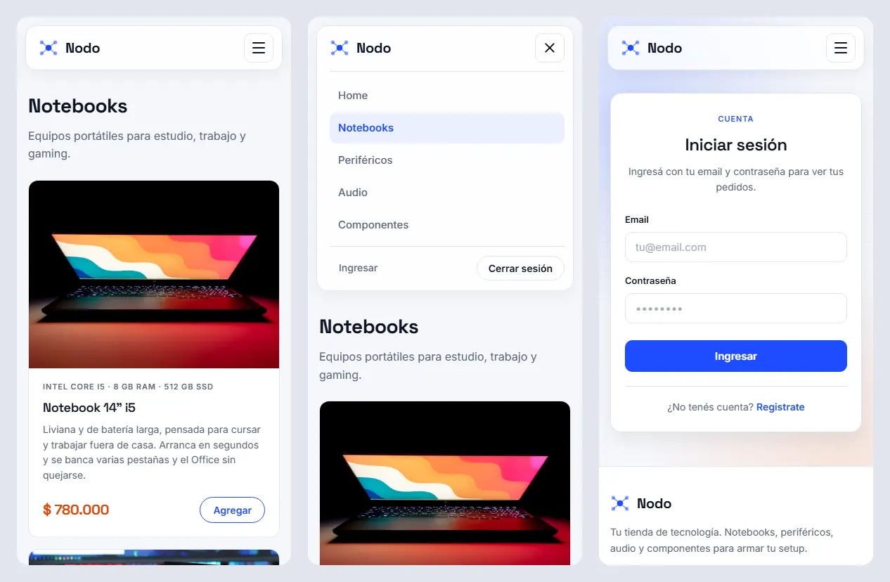

# Nodo — Ecommerce

**Autor:** Pablo Ezequiel Figueroa

## Descripción

Nodo es una tienda online de tecnología desarrollada como trabajo práctico de la
materia. Vende notebooks, periféricos, audio y componentes de PC.

El proyecto se entrega por etapas:

- **Etapa 1:** estructura general de la aplicación con HTML (home, categorías,
  login y registro).
- **Etapa 2 (actual):** estilos e identidad visual con CSS.

Todavía no hay lógica de servidor ni base de datos.




## Estructura del proyecto

```
nodo-ecommerce/
├── index.html          Página de inicio (home)
├── login.html          Formulario de inicio de sesión
├── registro.html       Formulario de registro de usuario
├── notebooks.html      Categoría: Notebooks
├── perifericos.html    Categoría: Periféricos
├── audio.html          Categoría: Audio
├── componentes.html    Categoría: Componentes
├── img/                Logo (SVG) y fotos de productos (WebP, Unsplash)
├── capturas/           Capturas de pantalla para este README
├── css/
│   └── estilos.css     Hoja de estilos general
└── README.md
```

## Etapa 2: estilos e identidad

Los estilos están hechos con **CSS puro**, sin frameworks, en una sola hoja
(`css/estilos.css`) organizada por secciones: variables, base, navbar, hero,
grilla, tarjetas, formularios, pie de página y responsive.

### Paleta de colores

Todos los colores están definidos como variables en `:root`, así se pueden
cambiar desde un único lugar.

| Rol | Variable | Color |
|---|---|---|
| Principal (azul eléctrico) | `--acento` | `#1f4bff` |
| Principal oscuro (hover) | `--acento-oscuro` | `#1535cc` |
| Principal profundo (degradados) | `--acento-profundo` | `#0b1a66` |
| Secundario (ofertas) | `--secundario` | `#ff6b1a` |
| Secundario oscuro (precios) | `--secundario-oscuro` | `#d9480f` |
| Fondo | `--fondo` | `#f5f7fb` |
| Superficie (tarjetas, formularios) | `--superficie` | `#ffffff` |
| Texto | `--texto` | `#0f1424` |
| Texto secundario | `--texto-suave` | `#5a6378` |

El azul eléctrico es el color de la marca: logo, botones, links y página activa.
El naranja es su complementario y se reserva para precios y ofertas, para que
resalten en las tarjetas de producto.

### Tipografía

Se usan dos fuentes de [Google Fonts](https://fonts.google.com):

- **Space Grotesk** para títulos, la marca y los precios.
- **Inter** para el texto general, los formularios y la navegación.

### Logo

El logo es propio y está hecho en SVG (`img/logo.svg`): un nodo central
conectado a cuatro nodos, en referencia al nombre de la tienda. Se usa en el
navbar, en el pie de página y como favicon.

### Consignas cumplidas

- **Identidad y paleta:** paleta propia azul eléctrico + naranja, tipografía y
  logo.
- **Navbar:** barra flotante con fondo translúcido, página activa resaltada y
  botones de sesión. En pantallas chicas se convierte en un menú hamburguesa
  hecho solo con CSS.
- **Login y registro:** formularios centrados en una tarjeta, con estados de
  foco en los campos, sobre un fondo con degradados y grilla.
- **Card de producto:** foto, especificaciones, nombre, descripción, precio y
  botón "Agregar", con efecto al pasar el mouse.
- **Layout general:** grilla adaptable (`auto-fill`) que se usa en el home para
  las categorías y en cada categoría para los productos.
- **Opcional, logo propio:** `img/logo.svg`.
- **Opcional, fondos con degradados:** hero del home y fondo de login y
  registro.

### Decisiones de diseño

- **CSS puro:** alcanza para todo lo que pide la etapa y las variables de CSS
  cumplen el rol que tendrían las de SASS.
- **Sin JavaScript:** el menú hamburguesa usa un checkbox oculto y el selector
  `:checked`. JavaScript queda para las próximas etapas.
- **Imágenes en WebP:** las fotos pasaron de JPG a WebP y el peso total bajó de
  572 KB a 288 KB. El logo está en SVG.
- **Responsive:** el menú hamburguesa aparece desde 960 px para abajo y desde
  600 px se ajustan márgenes, títulos, hero, formularios y footer.

## Cómo verlo

Cloná el repositorio y abrí `index.html` en el navegador:

```bash
git clone https://github.com/pablofigueroa16/nodo-ecommerce.git
cd nodo-ecommerce
```

## Próximas etapas

- Listado de productos y detalle de producto.
- Carrito de compras.
- Validación de formularios con JavaScript.

## Créditos

Las fotos de productos provienen de [Unsplash](https://unsplash.com) y se usan
bajo la [Unsplash License](https://unsplash.com/license), que permite su uso
gratuito, incluso comercial, sin requerir atribución. Están descargadas en
`img/` para que el sitio funcione sin depender de servicios externos.

Las fuentes Inter y Space Grotesk se usan bajo la
[SIL Open Font License](https://openfontlicense.org).
